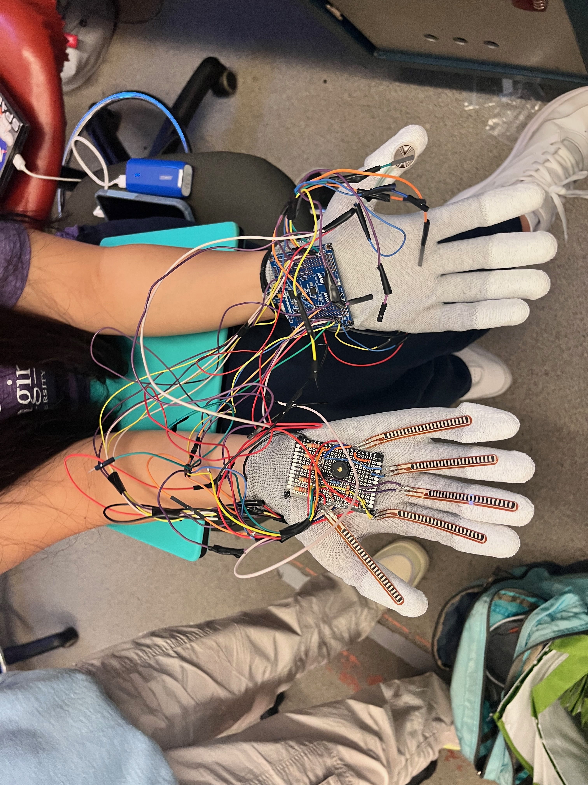
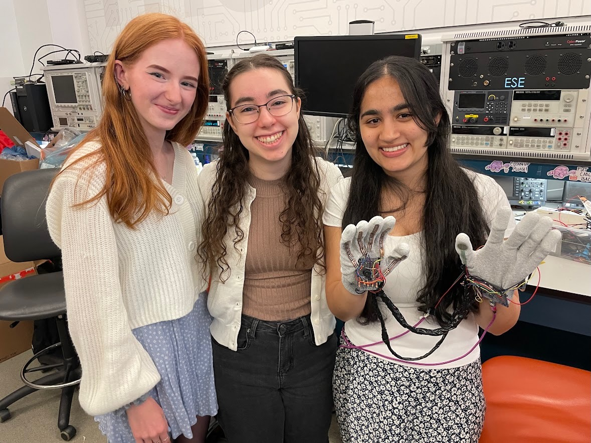
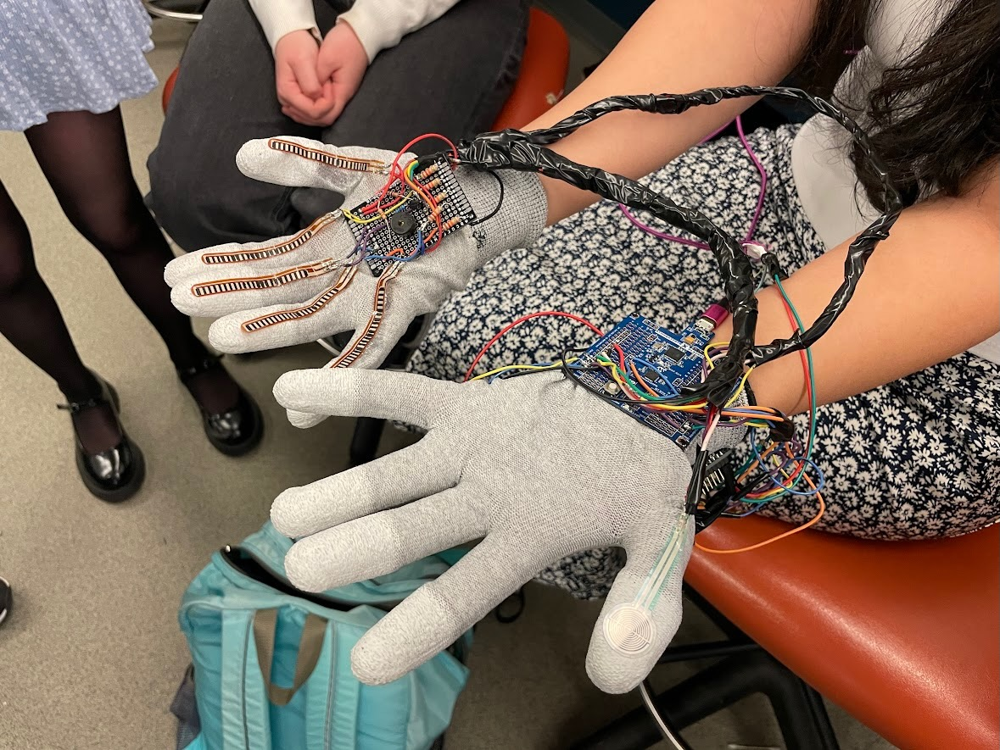
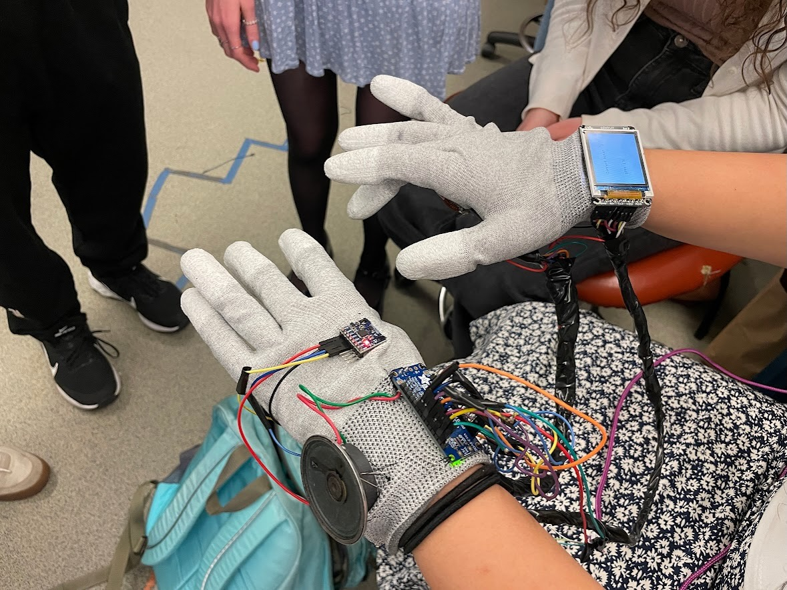
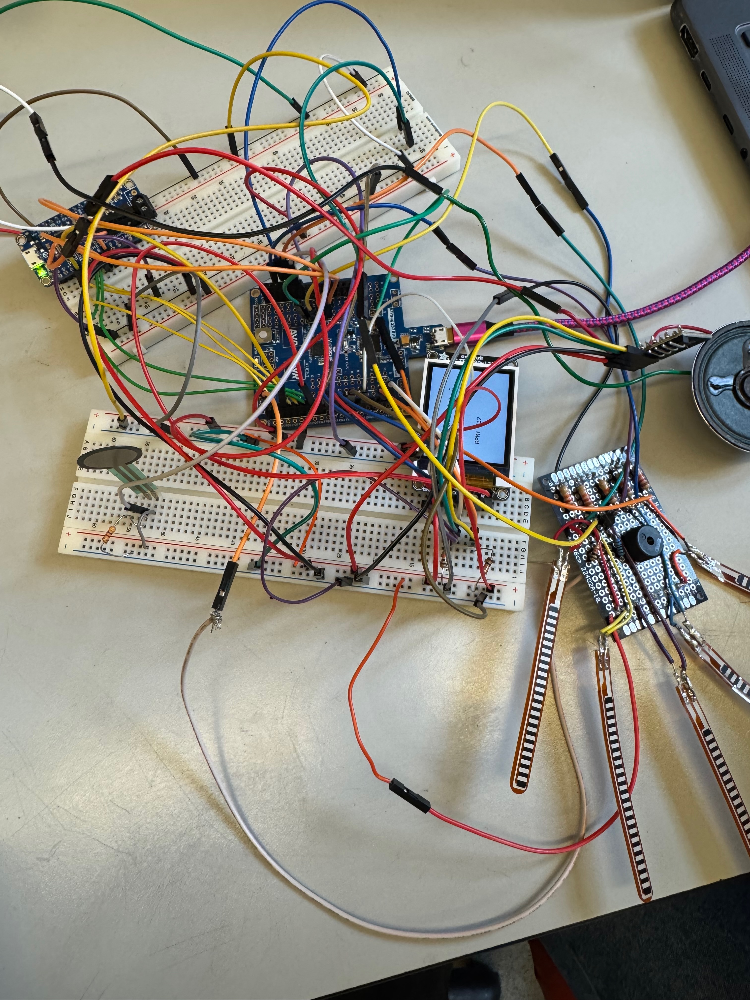

# final-project-abstract-stack-machine

* Team Number:  4
* Team Name:  Abstract Stack Machine
* Team Members:  Aarti Sabharwal, Sydney Fitzgerald, Maria-Christina Nicolaides
* GitHub Repository URL: https://github.com/upenn-embedded/final-project-s25-abstract-stack-machine.git
* GitHub Pages Website URL: https://upenn-embedded.github.io/final-project-s25-abstract-stack-machine/

## Final Project Report

See linked website for full final product! 

### 1. Video

[Video](https://www.youtube.com/watch?v=cX5P7uVT91A)

### 2. Images

*Include photos of your device from a few angles. If you have a casework, show both the exterior and interior (where the good EE bits are!).*

### 3. Results

*What were your results? Namely, what was the final solution/design to your problem?*

The final solution to our problem of creating a portable musical instrument similar to a piano was to create an Atmega328PB-driven project that also used the Adafruit sound module, a speaker to go along with the sound module, an LCD screen, flex sensors, a pressure sensor, and a buzzer.  The instrument uses ADC on the Atmega to sense whether one of the right hand fingers is bent through the flex resistors attached to the right hand fingers.  When the ADC interrupt picks up on one of the fingers being bent, it sends a signal to the corresponding pin on the Atmega that then sends a GND signal to the corresponding pin on the sound board (which has an audio file for that note attached to it), which then plays the note on the speaker.  On the other hand (the left hand), the pressure sensor, through the same ADC interrupt, is used so that when the interrupt picks up on the pressure sensor being tapped, it sounds the buzzer for a short amount of time (like that of a drum hit).  The gyroscope on the left hand uses I2C communication so that when the left hand is palm-down, the third, fourth, and fifth fingers of the right hand are E, F, and G, and when the left hand is palm-up, they are A, B, and treble C respectively. The LCD screen uses SPI communication and displays the current note being played and the current beats per minute of the drum.

#### 3.1 Software Requirements Specification (SRS) Results

*Based on your quantified system performance, comment on how you achieved or fell short of your expected requirements.*

*Did your requirements change? If so, why? Failing to meet a requirement is acceptable; understanding the reason why is critical!*

*Validate at least two requirements, showing how you tested and your proof of work (videos, images, logic analyzer/oscilloscope captures, etc.).*

| ID     | Description                                                                                                                                                                                                                                         | Validation Outcome                                                                                                                                                                                      |
| ------ | --------------------------------------------------------------------------------------------------------------------------------------------------------------------------------------------------------------------------------------------------- | ------------------------------------------------------------------------------------------------------------------------------------------------------------------------------------------------------- |
| SRS-01 | The system shall get the current note being played and print the note out on the screen within 1s.                                                                                                                                                  | Validated: Video is in validation folder. The screen updates and the note plays well within 1s.                                                                                                         |
| SRS-02 | There shall be a separate input capture interrupt for each finger on the note-playing hand, so that each can output a note when that finger is pushed down.                                                                                         | Changed: We are not using input capture interrupts. However, we are outputting notes when each finger is put down.                                                                                      |
| SRS-03 | A timer shall be used to generate a low PWM signal for the buzzer acting as the drum whenever the finger for the drum is down.                                                                                                                      | Validated: Vdeo is in validation folder. The PWM wave can be seen on the oscilloscope and the frequency is 122 Hz.                                                                                      |
| SRS-04 | The system shall be able to distinguish from a slight twitch in a finger to actually playing the note using debouncing by only outputting a note if the finger was “down” for longer than a half a second.                                        | Changed: Rather than debouncing based on timing, we use a different ADC threshold for each finger. We also made sure that a given note does not play again until it is stretched out again and re-bent. |
| SRS-05 | Voltage across each force resistor shall be analyzed at its own output pin, such that using ADC, we can convert a range of voltages to either on or off, signifying if a finger is fully bent.  If it is, the corresponding sound shall be produced | Confirmed: This description matches how we are currently producing the notes in the software.                                                                                                           |

#### 3.2 Hardware Requirements Specification (HRS) Results

*Based on your quantified system performance, comment on how you achieved or fell short of your expected requirements.*

*Did your requirements change? If so, why? Failing to meet a requirement is acceptable; understanding the reason why is critical!*

*Validate at least two requirements, showing how you tested and your proof of work (videos, images, logic analyzer/oscilloscope captures, etc.).*

| ID     | Description                                                                                                                                                                                     | Validation Outcome                                                                                                                                                                                                                                                                                         |
| ------ | ----------------------------------------------------------------------------------------------------------------------------------------------------------------------------------------------- | ---------------------------------------------------------------------------------------------------------------------------------------------------------------------------------------------------------------------------------------------------------------------------------------------------------- |
| HRS-01 | Five flex sensors shall be used, one on each finger of a glove, to detect finger bending for note generating. Each sensor shall detect a range of motion of at least 90 degrees.                | Confirmed: We are able to bend our fingers fully and produce the notes. This can be seen in our main demo video.                                                                                                                                                                                           |
| HRS-02 | One force-sensitive resistor shall be used to produce the drum beats and shall detect pressures in the range of 0.2 N to 10 N, only sounding a drum once if a finger is held down continuously. | Confirmed through testing--we ensured that we could detect the pressure from a range of finger taps of different strengths.                                                                                                                                                                              |
| HRS-03 | An audio breakout board shall be used to generate a PWM signal for a speaker, which shall produce frequencies in the range of 250 Hz to 1000 Hz.                                                | Validated: Video in validation folder. Middle C is about 261 Hz and high C is about 523 Hz, so our entire range of notes falls into the 250-1000 Hz range, and additionally, they are tuned properly.the range.                                                                                           |
| HRS-04 | A buzzer shall be used to create a drum beat. It shall produce sound using low-frequency PWM signals in the range of 30 Hz to 100 Hz.                                                           | Failed to meet: We were not able to make the buzzer audible at a frequency that low. If we did this project again, we might have used a different buzzer or another way of producing sound. However, our buzzer was at 122 Hz (shown in SRS-03 video) and so this was close to the upper end of our range. |
| HRS-05 | An LCD screen shall be used to display the current note playing and the beats per minute of the current drum beat, based on the average time between the last four drum beats played.           | Validated: Videos in validation folder (HRS-05a and HRS-05b). Note that we are now using the last five drum beats played in our calculation. We can see that the BPM changes accordingly to around 60 BPM and 120 BPM.                                                                                     |
| HRS-06 | A gyroscope shall be used to change the volume of the music produced and shall detect a range of motion of at least 180 degrees.                                                                | Changed: The gyroscope can detect this range of motion, as we must flip our hand 180 degrees to change the note range (this can be seen in the demo video). However, we are now using the gyroscope to extend the range of notes rather than the volume.                                                 |

### 4. Conclusion

Reflect on your project. Some questions to address:

* What did you learn from it?
* What went well?
* What accomplishments are you proud of?
* What did you learn/gain from this experience?
* Did you have to change your approach?
* What could have been done differently?
* Did you encounter obstacles that you didn’t anticipate?
* What could be a next step for this project?

We all learned a lot from this project, including how best to debug hardware both through print statements and probing.  We also learned how best to handle many different parts working together, especially since we had to figure out how to best handle 6 different ADC devices with only one ADC interrupt.  A couple of aspects of our project went well.  Firstly, the buzzer effectively works each time the pressure sensor is tapped, and the BPM calculation is consistently correct.  Furthermore, the screen does a good job of consistently displaying the BPM and the current note being played.  Lastly, having multiple ADC devices working at the same time was a concern, but that was always consistently working as well.  One accomplishment we are particularly proud of is getting the gyroscope to work.  It took a lot of debugging on our end, but it was really cool to see the gyroscope so effectively be able to switch the notes just be turning our hand over.  We never had to change our entire approach, but for the gyroscope, we did change what it did.  Previously, we said it would change the volume of the music.  However, the sound board we were using was not very effective at changing the volume of the audio noticeably enough so we ended up using the gyroscope to add a full scale of notes.  In the end, we actually preferred this approach because it allowed us to have a wider range of songs we can play on the instrument.  One major obstacle we encountered that we did not anticipate was that when we soldered, since everything was so delicate, the soldering was not quite enough to make the project work all of the time, so we had to do a lot of debugging with the connections to make it work completely.  This caused a lot of problems, and if we could go back we would instead spend more time soldering all of the connections strongly the first time so that we did not have to go back and fix so many of them later.  Another unanticipated obstacle that we encountered was that the buzzer was not working because we used Timer3 on the Atmega for the buzzer and we did not realize that UART also uses Timer3.  Because of this, we spent a lot of time debugging it since we were trying to use UART for debugging at the same time as playing the timer, but eventually we realized our mistake and stopped using UART while using the buzzer.  Some next steps for this project would be to secure the connections better through better soldering, make a wider range of notes with better usage of the gyroscope (perhaps it could change octaves completely), and change the buzzer so that it uses an additional sound board to sound more like a drum.

## References

Fill in your references here as you work on your final project. Describe any libraries used here.

LCD Library (Lab 4: Pong)

I2C Library (written based on documentation)

ADC Code (used initialization code from class repository)

UART Library (only used for debugging/validation, from class repository)
