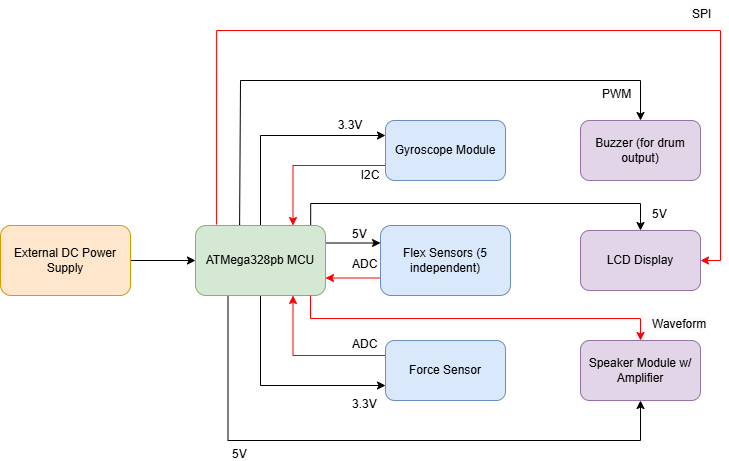
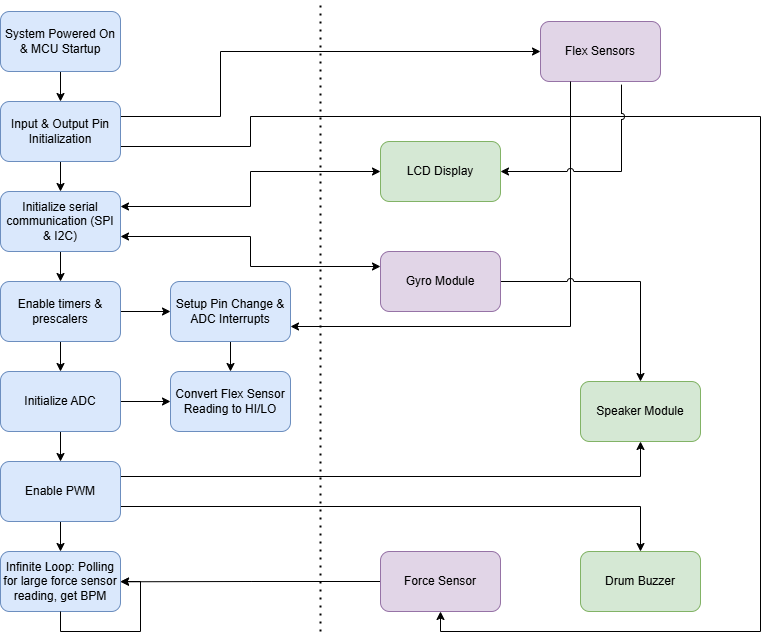
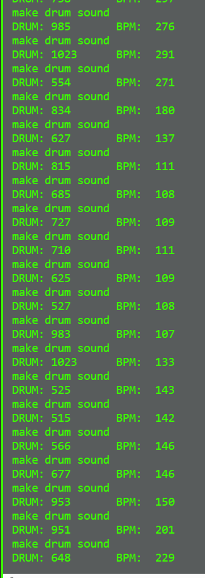
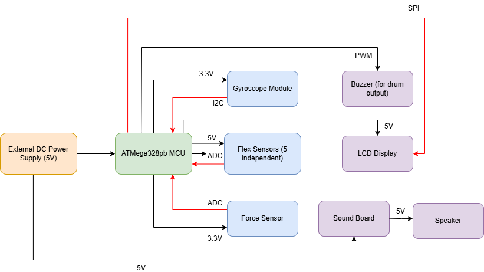
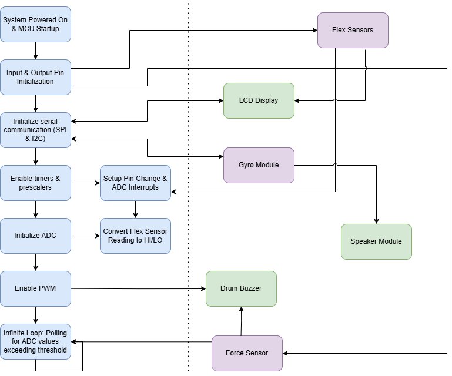

# final-project-skeleton

* Team Number:  4
* Team Name:  Abstract Stack Machine
* Team Members:  Aarti Sabharwal, Sydney Fitzgerald, Maria-Christina Nicolaides
* GitHub Repository URL: https://github.com/upenn-embedded/final-project-s25-abstract-stack-machine.git
* GitHub Pages Website URL: [for final submission]

## Final Project Proposal

### 1. Abstract

*In a few sentences, describe your final project.*

Our final project will consist of two gloves that are used to make music. On one hand, the user can bend their fingers to generate different notes, and on the other hand, the user can tap their fingers to generate drum beats. A screen will inform the user of their current notes played and the BPM of their drumming and there will also be volume control using a gyroscope.

### 2. Motivation

*What is the problem that you are trying to solve? Why is this project interesting? What is the intended purpose?*

The inspiration of this project is that we were considering how the piano, and other similar instruments, is not very accessible due to its high cost and size.  We wanted to find a way to make instruments such as pianos accessible so that people can play them anywhere and at a lower cost, which is how we decided to work on musical gloves.  Musical gloves allow people to have music at their fingertips, literally.  Furthermore, they are fairly straightforward to play since there are only five notes and a drum beat, so it allows people of varied backgrounds musically to use them.  Additionally, as mentioned before, physical instruments are generally expensive, especially pianos which can range from 100 dollars to thousands of dollars.  Thus, these gloves will be accessible to people of many different economic backgrounds, which achieves our goal of bringing music to a wider range of people.  Lastly, these gloves are exceptionally space efficient since they are just hand-sized gloves, so they can even be used as a “travel” or “dorm room” instrument.

### 3. System Block Diagram

*Show your high level design, as done in WS1 and WS2. What are the critical components in your system? How do they communicate (I2C?, interrupts, ADC, etc.)? What power regulation do you need?*

Hardware:

Software:

### 4. Design Sketches

*What will your project look like? Do you have any critical design features? Will you need any special manufacturing techniques to achieve your vision, like power tools, laser cutting, or 3D printing?*

### 5. Software Requirements Specification (SRS)

*Formulate key software requirements here. Think deeply on the design: What must your device do? How will you measure this during validation testing? Create 4 to 8 critical system requirements.*

*These must be testable! See the Final Project Manual Appendix for details. Refer to the table below; replace these examples with your own.*

The device must be able to produce at least 5 different tones and a drum beat.  It must be able to play notes one after another.  It also must be able to display the note currently being played on the screen that is on the glove.

For validation testing:

1. We will use a tuner to determine whether the notes produced are correct.
2. We will use a logic analyzer to debug and analyze the serial communication with the screen.
3. We will print the results of ADC conversion and various flags in our software to determine whether the interrupts are functioning correctly and that the order of software output is correct.

**5.1 Definitions, Abbreviations**

Here, you will define any special terms, acronyms, or abbreviations you plan to use for hardware
N/A

**5.2 Functionality**

| ID     | Description                                                                                                                                                                                                                                         |
| ------ | --------------------------------------------------------------------------------------------------------------------------------------------------------------------------------------------------------------------------------------------------- |
| SRS-01 | The system shall get the current note being played and print the note out on the screen within 1s.                                                                                                                                                  |
| SRS-02 | There shall be a separate input capture interrupt for each finger on the note-playing hand, so that each can output a note when that finger is pushed down.                                                                                         |
| SRS-03 | A timer shall be used to generate a low PWM signal for the buzzer acting as the drum whenever the finger for the drum is down.                                                                                                                      |
| SRS-04 | The system shall be able to distinguish from a slight twitch in a finger to actually playing the note using debouncing by only outputting a note if the finger was “down” for longer than a half a second.                                        |
| SRS-05 | Voltage across each force resistor shall be analyzed at its own output pin, such that using ADC, we can convert a range of voltages to either on or off, signifying if a finger is fully bent.  If it is, the corresponding sound shall be produced |

### 6. Hardware Requirements Specification (HRS)

*Formulate key hardware requirements here. Think deeply on the design: What must your device do? How will you measure this during validation testing? Create 4 to 8 critical system requirements.*

*These must be testable! See the Final Project Manual Appendix for details. Refer to the table below; replace these examples with your own.*

Our hardware must be able to accurately detect and process finger movements to produce notes and drum beats. Our input devices must be sensitive to our finger motions and our output devices must produce notes and drum beats according to the input.

Validation testing:

1. We will test the flex sensors by verifying they produce the expected resistance changes when the fingers bend.
2. We will measure the outputs of the force sensor under different pressures to confirm accurate force detection.
3. We will use an oscilloscope on different parts of our circuit to determine whether the voltage is correct based on the inputs we have.

**6.1 Definitions, Abbreviations**

Here, you will define any special terms, acronyms, or abbreviations you plan to use for hardware
N/A

**6.2 Functionality**

| ID     | Description                                                                                                                                                                                     |
| ------ | ----------------------------------------------------------------------------------------------------------------------------------------------------------------------------------------------- |
| HRS-01 | Five flex sensors shall be used, one on each finger of a glove, to detect finger bending for note generating. Each sensor shall detect a range of motion of at least 90 degrees.                |
| HRS-02 | One force-sensitive resistor shall be used to produce the drum beats and shall detect pressures in the range of 0.2 N to 10 N, only sounding a drum once if a finger is held down continuously. |
| HRS-03 | An audio breakout board shall be used to generate a PWM signal for a speaker, which shall produce frequencies in the range of 250 Hz to 1000 Hz.                                                |
| HRS-04 | A buzzer shall be used to create a drum beat. It shall produce sound using low-frequency PWM signals in the range of 30 Hz to 100 Hz.                                                           |
| HRS-05 | An LCD screen shall be used to display the current note playing and the beats per minute of the current drum beat, based on the average time between the last four drum beats played.           |
| HRS-06 | A gyroscope shall be used to change the volume of the music produced and shall detect a range of motion of at least 180 degrees.                                                                |

### 7. Bill of Materials (BOM)

*What major components do you need and why? Try to be as specific as possible. Your Hardware & Software Requirements Specifications should inform your component choices.*

*In addition to this written response, copy the Final Project BOM Google Sheet and fill it out with your critical components (think: processors, sensors, actuators). Include the link to your BOM in this section.*

The major components of this project are flex sensors, force-sensitive resistors, a gyroscope, a speaker module with an amplifier, buzzers, and LCD screen, and the ATmega microcontroller. The flex sensors will be placed on the fingers of one glove to detect bending and produce notes. The force-sensitive resistors will be used on the other glove to detect tapping pressure and produce drum beats. A gyroscope will be used for volume control, based on the orientation of the glove. A speaker module with an amplifier will be used to ensure  clear audio, and buzzers will be used for drum beats. The LCD screen will provide real-time feedback, displaying the current note being played and the beats-per-minute of the drum. The ATmega328PB will be the processing unit for the entire system.

Link to BOM:  [https://docs.google.com/spreadsheets/d/1fDWNhmdyrAUO53iy5cZIY6yOvVTOgB8NUdtprJ25Ou8/edit?usp=sharing]()

### 8. Final Demo Goals

*How will you demonstrate your device on demo day? Will it be strapped to a person, mounted on a bicycle, require outdoor space? Think of any physical, temporal, and other constraints that could affect your planning.*

We will demonstrate the device by having one of us wear the gloves and play a song with them.  There are not many constraints to playing the gloves as that is the main purpose of them.  However, issues may arise if we hurt our hands in some way.

### 9. Sprint Planning

*You've got limited time to get this project done! How will you plan your sprint milestones? How will you distribute the work within your team? Review the schedule in the final project manual for exact dates.*

| Milestone  | Functionality Achieved                                                                                  | Distribution of Work                                                                                                                                        |
| ---------- | ------------------------------------------------------------------------------------------------------- | ----------------------------------------------------------------------------------------------------------------------------------------------------------- |
| Sprint #1  | Make drum work properly, sew the compartment on the gloves for the hardware, make speaker produce notes | Aarti - code for drum/speakers Sydney - soldering, sewing, help with circuit MC - Work on circuit for hardware, work with Aarti to test with code |
| Sprint #2  | Make flex sensors work, make sure ADC works                                                             | MC - work with flex sensors Sydney - work with ADC Aarti - help with both flex sensors and ADC (focusing on code)                                 |
| MVP Demo   | Make gyroscope work                                                                                     | Aarti - code for gyroscope Sydney - circuit integration for gyroscope MC - help with testing code and hardware together                           |
| Final Demo | Make screen work, test everything, add additional features, solder any parts that are not yet secured   | Aarti/MC - work on code for screen Sydney - soldering, hardware for screen All - testing                                                          |

**This is the end of the Project Proposal section. The remaining sections will be filled out based on the milestone schedule.**

## Sprint Review #1

### Last week's progress

This week we started off by ordering our parts.  We also used some of Detkin's flex resistors/pressure sensor to test how they work and make the ADC in our code work with it (see picture attached below).  We also worked on the code for once our other parts arrive, so that we can test with the hardware immediately.  This code can be seen in the main.c file within our code folder.  We worked on the LCD display code, the drum code, and the code to produce notes depending on which finger is being pressed down.

### Current state of project

* We understand how to work with the flex resistors and pressure sensor, and we have tested the range of values that we receive with different resistor values in series.
* Our parts have been ordered, and we have received our gyroscope part.
* We wrote most of the code, so as we receive parts this week, the code will be ready to test with.

### Next week's plan

* Finish the drum's BPM calculation in the code (besides that, the drum code is currently finished)
* Once we get the sound module, record the notes, test sound module with code
* Figure out how to use the gyroscope effectively and, correspondingly, the volume control
* Test LCD screen with code, possibly make the display on the LCD screen more elaborate if there is time

## Sprint Review #2

### Last week's progress

We got the notes to play on the speaker when the flex sensor corresponding to that note bends.  We also got the LCD to display the current note and the current correct metronome time based on how fast the drum is playing.  Lastly, we finished the code and started working on getting the gyroscope and buzzer for the drum to work.

### Current state of project

Currently, we are able to have each flex sensor map to a recording of a note uploaded to the sound board, have the LCD display properly, and the code is displaying the correct metronome speed.

Video of notes being played:  https://urldefense.com/v3/__https://drive.google.com/file/d/1KBB0TX3Fz0eO-971sgEhP2V4Q8SCNbPN/view?usp=sharing__;!!IBzWLUs!VyujkIu8VdPW4JN_7TM5EVhrKQ7qoLnUNACdtYz9dQbhhgWm7lLtnuIVqeHwmLHvDTPRrnVH5BqXGENh1URaaV2y$

### Next week's plan

Next week, we hope to finish the gyroscope and buzzer, and then we will hopefully solder everything together and have our MVP!  We will also have the notes play faster by cutting the files to be shorter for each note.

## MVP Demo

1. Show a system block diagram & explain the hardware implementation.

2. Explain your firmware implementation, including application logic and critical drivers you've written.

Note playing / Drum beats: We use the ADC interrupt to obtain the ADC value corresponding to each flex resistor on each finger and the pressure sensor for the drum. In the ADC interrupt, we switch the ADMUX value to cycle through converting the values of each finger, and we assign these values accordingly.
LCD Screen: We are using the SPI serial communication protocol to display the current note and BPM on the LCD screen.
Gyroscope: We are using the I2C serial communication protocol to obtain the tilt of the gyroscope and trigger different notes to play. 
Drum: We are generating a PWM wave at a low frequency in order to power the buzzer that acts as the drum.
Sound module: We communicate with the sound module just by using GPIO pins and pulling a certain trigger pin low when we want its corresponding note file to play.

3. Demo your device.

Done during MVP Demo.

4. Have you achieved some or all of your Software Requirements Specification (SRS)?

SRS-01: We have achieved this as the current note displays on the screen while the note plays.
SRS-02: We are instead implementing this feature with ADC instead of input capture interrupts.
SRS-03: We have achieved this, as the buzzer makes a noise whenever the user presses the pressure sensor.
SRS-04: We are not using this exact debouncing technique, but we are instead playing the note only when a certain threshold of bending has been reached, and requiring the user to unbend their finger before playing that note again. We have also added debouncing to the pressure sensor by making sure that one tap corresponds to one drum beat, by checking the timer values of the detected taps.
SRS-05: We have achieved this as using an ADC threshold value is how we determine whether a note should play.

   1. Show how you collected data and the outcomes.

   In the initial stages, we used many print statements to look at variables during our execution. We determined the ADC thresholds for the fingers and drum using this method, in addition to the timer "debouncing" value we used for the drum beats. After our parts began working, for most of our testing, it was easy to see if our funcionality was correct--we checked that the correct notes played when they were supposed to, the drum buzzer produced sound, the LCD changed accordingly, and the gyroscope affected the notes.

5. Have you achieved some or all of your Hardware Requirements Specification (HRS)?

HRS-01: We achieved this as it provides our basic note playing functionality.
HRS-02: We have partially achieved this as our force sensitive resistor can detect pressures of finger taps. However, we have not yet added the functionality that the drum will be heard only once if a finger is held down continuously.
HRS-03: We changed the hardware we are using to produce sound. We are now using an audio board which plays recorded note files when a trigger pin is pulled low.
HRS-04: We have achieved this for our buzzer drum.
HRS-05: We are displaying this information on the screen, but we are using the last five drum beats played instead.
HRS-06: We are using a gyroscope which can detect the given range of motion, but we are now using it to add three higher notes (obtaining a full scale) rather than to change the volume.

   1. Show how you collected data and the outcomes.

   We used the oscilloscope when debugging to check that our pins were going high or low as expected, and to see the PWM wave for the buzzer. For our other hardware requirement specifications we could tell if they were met by hearing the notes played, seeing the screen display, etc.

6. Show off the remaining elements that will make your project whole: mechanical casework, supporting graphical user interface (GUI), web portal, etc.

We need to finish soldering all the parts to make the entire system more compact and we need to sew them onto the gloves we will use. We also may make the LCD display look less plain. We also need to figure out how to power both the ATMega and the sound module / speaker with a battery rather than the benchtop power supply.

7. What is the riskiest part remaining of your project?

The riskiest part remaining of our project is moving all of our components onto gloves, because there is the risk that we will do something incorrectly and a part will stop working or not work as well.

   1. How do you plan to de-risk this?

   We plan to de-risk this by testing our parts at every stage as we transfer them to the gloves, and being careful to have all the necessary and correct connections.

8. What questions or help do you need from the teaching team?

We do not currently have questions.

## Final Project Report

Don't forget to make the GitHub pages public website!
If you’ve never made a GitHub pages website before, you can follow this webpage (though, substitute your final project repository for the GitHub username one in the quickstart guide):  [https://docs.github.com/en/pages/quickstart](https://docs.github.com/en/pages/quickstart)

### 1. Video

[Insert final project video here]

* The video must demonstrate your key functionality.
* The video must be 5 minutes or less.
* Ensure your video link is accessible to the teaching team. Unlisted YouTube videos or Google Drive uploads with SEAS account access work well.
* Points will be removed if the audio quality is poor - say, if you filmed your video in a noisy electrical engineering lab.

### 2. Images

[Insert final project images here]

*Include photos of your device from a few angles. If you have a casework, show both the exterior and interior (where the good EE bits are!).*

### 3. Results

*What were your results? Namely, what was the final solution/design to your problem?*

#### 3.1 Software Requirements Specification (SRS) Results

*Based on your quantified system performance, comment on how you achieved or fell short of your expected requirements.*

*Did your requirements change? If so, why? Failing to meet a requirement is acceptable; understanding the reason why is critical!*

*Validate at least two requirements, showing how you tested and your proof of work (videos, images, logic analyzer/oscilloscope captures, etc.).*

| ID     | Description                                                                                               | Validation Outcome                                                                          |
| ------ | --------------------------------------------------------------------------------------------------------- | ------------------------------------------------------------------------------------------- |
| SRS-01 | The IMU 3-axis acceleration will be measured with 16-bit depth every 100 milliseconds +/-10 milliseconds. | Confirmed, logged output from the MCU is saved to "validation" folder in GitHub repository. |

#### 3.2 Hardware Requirements Specification (HRS) Results

*Based on your quantified system performance, comment on how you achieved or fell short of your expected requirements.*

*Did your requirements change? If so, why? Failing to meet a requirement is acceptable; understanding the reason why is critical!*

*Validate at least two requirements, showing how you tested and your proof of work (videos, images, logic analyzer/oscilloscope captures, etc.).*

| ID     | Description                                                                                                                        | Validation Outcome                                                                                                      |
| ------ | ---------------------------------------------------------------------------------------------------------------------------------- | ----------------------------------------------------------------------------------------------------------------------- |
| HRS-01 | A distance sensor shall be used for obstacle detection. The sensor shall detect obstacles at a maximum distance of at least 10 cm. | Confirmed, sensed obstacles up to 15cm. Video in "validation" folder, shows tape measure and logged output to terminal. |
|        |                                                                                                                                    |                                                                                                                         |

### 4. Conclusion

Reflect on your project. Some questions to address:

* What did you learn from it?
* What went well?
* What accomplishments are you proud of?
* What did you learn/gain from this experience?
* Did you have to change your approach?
* What could have been done differently?
* Did you encounter obstacles that you didn’t anticipate?
* What could be a next step for this project?

## References

Fill in your references here as you work on your final project. Describe any libraries used here.
